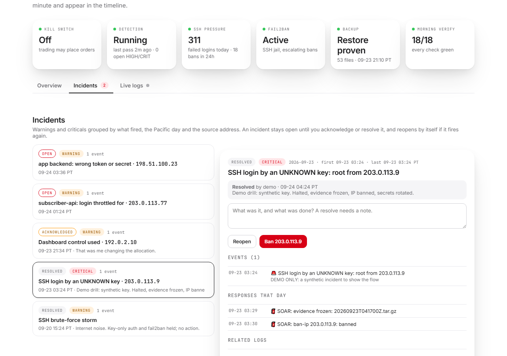
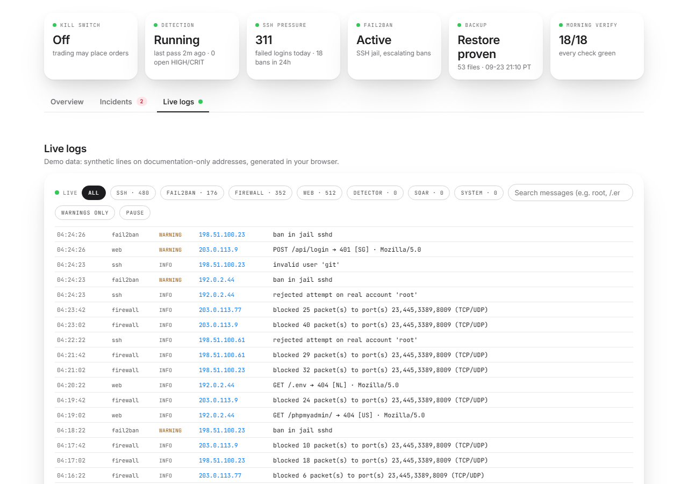
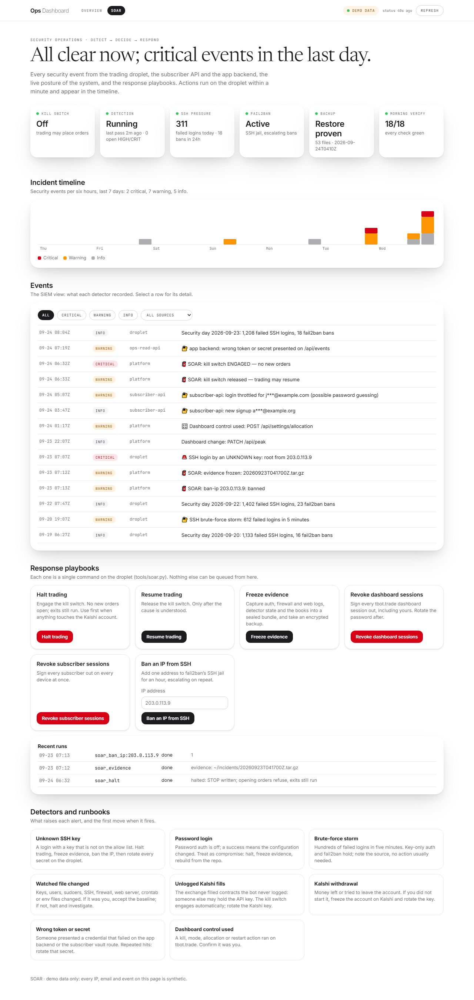
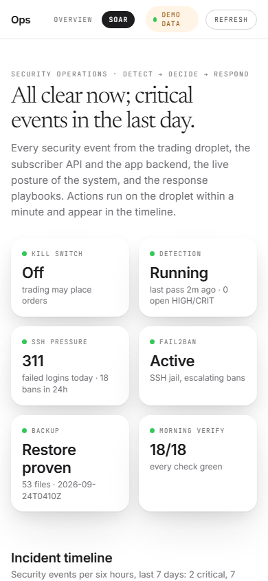
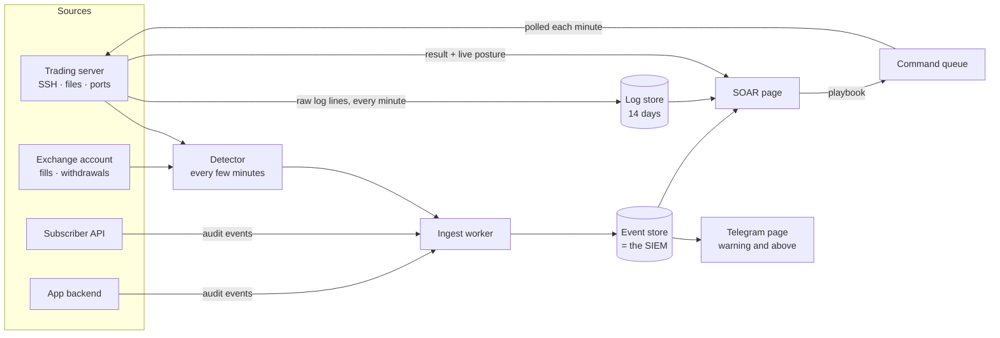

# T BOT Security Operations

> Detection, a SIEM and a response console for a live-money trading system, built and run by one engineer.

🌐 **Live:** ops.tbot.trade/soar *(behind Cloudflare Access, operator only; the screenshots below use the page's synthetic demo mode)*
🏗️ **Stack:** Python · Cloudflare Workers (TypeScript) · D1 · Pages · Access · GitHub Actions · nginx · UFW · fail2ban
🔒 **Source:** private. This README and the screenshots are the showcase.

---

## Screenshots

  

  

  
  &nbsp;&nbsp;
  

*The console in its synthetic demo mode: Incidents, Live logs, then the Overview and the phone layout. Every IP address, email and event is synthetic (RFC 5737 documentation ranges). The live page reads the same shapes from the production event store.*

## What it protects

[T BOT](https://github.com/kenmwara/tbot) trades real money on Kalshi prediction markets, around the clock, with nobody watching. Three things face the internet: the operator dashboard that holds the kill switch, a subscriber API that stores encrypted exchange keys, and the backend of the mobile app. A breach of any of them is a financial event, so security is treated as part of the trading system rather than something beside it.

## The four layers

**1. Prevention.** The trading server answers only Cloudflare: the firewall admits web traffic from Cloudflare's published ranges alone, and the web server demands Cloudflare's origin-pull client certificate, so going around the proxy to the server's address gets no answer. SSH is key-only behind fail2ban, and root cannot log in over it at all: administration goes through a named account whose every privileged command is logged into the SIEM. The operator console sits behind Cloudflare Access, and a small edge function sends the hosting platform's own default hostname back to the protected domain. The response tooling runs as an unprivileged user whose sudo rights cover exactly one command. Secrets move through a file pipe and never reach a terminal, a log or git. A nightly AES-256 encrypted backup lands in a private repository, and its restore is proven every night rather than assumed.

**2. Detection.** A detector runs every few minutes and raises:

- an SSH login with a key that is not on the allow list, or any password login (critical);
- a brute-force storm (a heads-up, since key-only auth holds);
- a change to any file security depends on: keys, users, sudoers, SSH, firewall, web server, scheduled jobs, environment files (root-owned files are hashed by a separate root job);
- a new listening port;
- **contracts filled on the exchange that the bot never logged.** This reconciles the exchange's own record against the trade log. If someone else is using the API key, the numbers stop matching, and the kill switch engages automatically;
- money leaving, or trying to leave, the exchange account.

Both APIs write an audit trail as well: signups, logins, throttled password guessing, bad webhook signatures, a wrong engine secret, a credential presented and refused, every use of a dashboard control.

**3. The SIEM.** Every event lands in one append-only store: the same D1 table the [Unified Ops Dashboard](https://github.com/kenmwara/unified-ops-dashboard) reads. Warning and above also pages the operator on Telegram. One store means one timeline: a login, the control it touched and the trade that followed sit on the same axis.

- **Live logs.** Every minute the server ships the lines that matter: SSH attempts, fail2ban bans, firewall blocks rolled up per source address, web errors and writes with the visitor's real address and country, the detector's findings and every playbook run. They are kept 14 days, and the console tails them every four seconds with source filters, search, a warnings-only switch, click-an-address and pause. With key-only SSH, an attack never shows up as a failed password. It shows as an invalid user, or as a closed pre-auth session against a real account, so the parser reads those.
- **Incidents.** Warnings are grouped by what fired, the day and the first routable source address. An incident stays open until the operator acknowledges or resolves it, a resolve needs a written note, and it reopens by itself if the same thing fires again. The detail shows its events, that day's playbook runs and every log line from that address, with a button to ban it. The console's first line says how many incidents need you; "Nothing needs you" is a state it has to earn.

**4. Response.** The SOAR page shows the verdict first, then posture (kill switch, detector freshness, SSH pressure, fail2ban, backup, the morning health check), the incident timeline, the event feed, and six playbooks:

| Playbook | What it does |
|---|---|
| Halt trading | Engages the kill switch: no new orders open, exits still run |
| Resume trading | Releases it, once the cause is understood |
| Freeze evidence | Seals auth, firewall and web logs, detector state and the books into a bundle, and takes an encrypted backup |
| Revoke dashboard sessions | Signs every operator session out |
| Revoke subscriber sessions | Signs every subscriber out on every device |
| Ban an IP | Adds one address to fail2ban's SSH jail |

The dangerous ones need a typed confirmation word. The page can only queue a playbook from a fixed list; the queue validates it, the server re-validates it (a ban takes exactly one IP address, parsed as one), runs it, and writes the result back to the page, usually within a minute. Every run is itself an event in the SIEM.

## How it is kept honest

**An audit that reports nothing must list what it attacked.** A clean security audit after the server rebuild found nothing. A second pass that attacked the system instead of reading it found real problems. So that became a rule, and every finding class now has a check that runs without anyone remembering to run it:

- **A nightly red team from GitHub Actions**, outside the network, calls every authenticated dashboard route with no token (the route list is parsed from the source, so a new route is covered the day it ships), forges and injects tokens, replays webhooks, tries to fetch secrets and source by path traversal, goes around the proxy to the origin, and checks TLS and CORS. The harness is mutation-tested: it must report a planted leak, or the deploy gate fails, because a checker that cannot fail proves nothing.
- **The deploy gate** runs the kill-switch tests and the red-team self-check on every push.
- **A morning health check** requires the detector to be running with no open high or critical finding, and every backup heartbeat to be fresh.

## What went wrong, and what it taught

- **The kill switch did not stop the live path.** The stop file was honoured by the general order path, but the live strategy and the resting-order book placed orders through functions that never read it. The guard now sits in the one function every opening order passes through, exits are deliberately exempt, and tests pin both.
- **A worker-to-worker call failed silently.** One Cloudflare Worker cannot fetch another's default hostname; the request simply never arrived. Audit events now travel over a service binding.
- **The first red-team run reported five breaches that were all a deploy restarting.** A 502 says nothing about whether an attack works, so the harness now retries through a restart before judging.
- **The console had a second front door.** Access guarded the custom domain, but the hosting platform also served the page on its own default hostname, which Access never sees. No data leaked (every API call needs a token), but the fix was an edge redirect plus a red-team probe that failed before the fix and passes after it.
- **A reboot looked like an intrusion.** The detector ran mid-shutdown, saw the web server's ports closed, dropped them from its baseline, and paged "new listening port" three times when they came back. Known ports now stay known, and the deploy gate replays a reboot and fails on the old logic.
- **The web logs saw the wrong visitor.** nginx only ever sees Cloudflare's edge, so every web line carried a Cloudflare address. The application already receives the real one in a header, so it now writes the security-relevant requests itself, with the real address and country.
- **Closing root SSH also closed the provider's web console.** The hosting provider's browser console turned out to be SSH underneath: its agent writes a temporary key into the account's key file and connects from the provider's relays. With root refused, the console failed, and its key write set off a critical file-integrity alert. Nobody got in, and the logs showed both the refused logins and the agent's own key writes. The fix was a named admin account plus a non-SSH recovery console as break-glass, and the lesson is to map every path that depends on a control before switching it off.
- **A confirmation dialog could hang.** The browser's dialog `close` event was deferred while the page was hidden, so a confirmation could wait forever. The console now resolves on the form's own submit and cancel events.

## The record so far

Since the September 2026 rebuild the auth logs show thousands of automated SSH attempts from across the internet and **no login by anyone but the operator**. A key found in the authorised list with no owner had never been used, and it was removed. The playbook path was drilled end to end on the live system: queued from the page, run on the server, result back on the page in under half a minute.

---

*Built by [Ken Mwara](https://github.com/kenmwara). The trading system it protects: [T BOT](https://github.com/kenmwara/tbot). The event store it runs on: [Unified Ops Dashboard](https://github.com/kenmwara/unified-ops-dashboard).*
